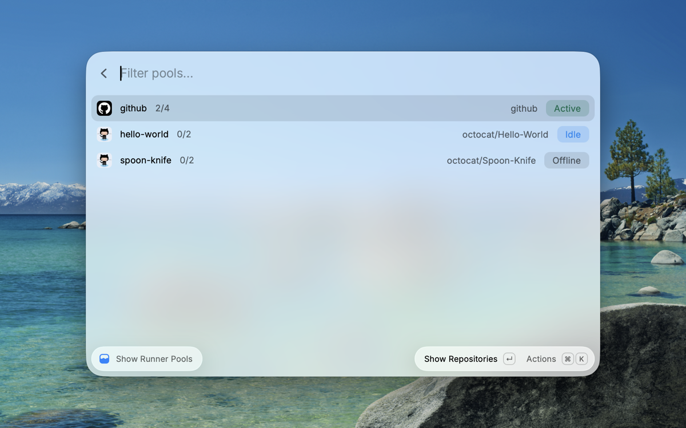

# RunPool: self-hosted GitHub Actions runner pools for macOS

[](https://github.com/aicayzer/runpool/actions/workflows/ci.yml)
[](https://github.com/aicayzer/runpool/releases)
[](LICENSE)

Runners wake when jobs queue and stand down when nothing has run for a while. Nothing sits in the background for a repository you are not touching, and nothing starts at login.

GitHub-hosted minutes are metered and macOS bills at ten times the Linux rate, so a busy repository gets expensive quickly. Self-hosted minutes are free, but GitHub's own runner is a poor houseguest on a machine you also use: it configures exactly one runner with no concept of a pool, gives you no way to change capacity afterwards, runs forever once started, and never cleans up. **RunPool makes it behave.**

There is a [Raycast extension](#raycast-extension) too.

## Getting started

Requires macOS on Apple Silicon and an authenticated [`gh`](https://cli.github.com).

```bash
brew install aicayzer/tap/runpool

runpool register acme --org acme-inc --count 4
runpool schedule install
```

Then point a workflow at the pool:

```yaml
jobs:
  test:
    runs-on: [self-hosted, acme]
```

That is the whole setup. Better still, put the target behind a repository variable, so you can move a repo between hosted and self-hosted without editing workflows:

```yaml
runs-on: ${{ vars.CI_RUNNER || 'ubuntu-latest' }}
```

The tap is [aicayzer/homebrew-tap](https://github.com/aicayzer/homebrew-tap), and `brew upgrade runpool` updates it. To work from source instead, `./install.sh` symlinks `runpool` onto your PATH from wherever you cloned it, so `git pull` is the update.

## How it works

**A pool is a set of runners bound to one GitHub scope.** GitHub offers repository, organisation and enterprise scopes and **no user-account scope**, which is the most surprising thing about self-hosted runners. An organisation shares one pool across all its repositories; a personal repository needs its own and cannot borrow an organisation's.

**Capacity and routing stay separate.** A workflow's `runs-on` decides where a job lands. RunPool decides only whether the runners are up, so a workflow pointed at a pool that is down waits for it rather than quietly rerouting to a hosted runner that costs ten times as much.

**Two launch agents drive everything.** A tick every 60 seconds brings up pools with queued work, stands down idle ones, and checks their registrations are still live. A clean at 04:00 prunes work directories, caches and superseded binaries, skipping any pool mid-job. Only stopped pools are polled, so active work costs no API calls at all.

The first job after a quiet spell waits about a minute for its pool to come up. Everything after that is immediate.

## Commands

| Command | |
|---|---|
| `register <pool> --repo OWNER/REPO\|--org ORG [--count N] [--allow-public]` | Create a pool and configure its runners |
| `set-count <pool> N` | Change a pool's runner count |
| `up` / `down <pool>` | Bring a pool online, or stand it down |
| `status [--json]` | Local state alongside what GitHub actually sees |
| `pools` | List registered pools |
| `reregister <pool>` | Recreate GitHub registrations, keeping the local install |
| `remove <pool>` | Deregister and delete a pool |
| `clean [pool]` | Prune work directories, temp, diagnostics, old binaries, caches |
| `stats` | What jobs actually cost, from recorded telemetry |
| `pause` / `resume` | Global kill switch |
| `schedule install\|remove` | The background agents that drive everything above |

**`status --json --local` skips the GitHub query**, reporting those fields as `null`. Anything refreshing on a timer should use it: one API call per pool per minute is thousands a day, and it makes a passive readout fail whenever the network does.

`skills/runpool/` is an agent skill for *using* RunPool: wiring a repository to local CI, choosing a scope, and diagnosing a job that queues and never starts.

## Raycast extension



Start and stop pools, change runner counts, disable local CI and see what is running, without a terminal. An optional menu bar readout and a set of AI tools come with it.

**In review for the Raycast store** ([raycast/extensions#30343](https://github.com/raycast/extensions/pull/30343)). Until it lands, run it from a clone of that branch with `npm install && npm run dev`.

## Notifications

RunPool detects. It does not deliver. Set `RUNPOOL_NOTIFY_CMD` to any command reading one JSON object on stdin:

```json
{ "severity": "warning", "title": "CI contention on my-mac: load 163, 5 jobs", "key": "runpool/contention/my-mac" }
```

Unset, it reports nothing and works as well. `contrib/notify-webhook.sh` is a reference implementation and shows the full shape.

**Two things are reported**, both about the pool's own health: a machine too contended to trust a result, and runners that are up but unreachable. Failed workflow runs deliberately are not, because watching CI results should not depend on this laptop being awake.

## Things worth knowing

- **A public repository is refused at registration**, because a pull request from an untrusted fork runs its own workflow file, which would hand any stranger a shell on your machine. `--allow-public` overrides it with a warning, so the decision is explicit rather than pushed into a forked copy of the tool. Registration also refuses when visibility cannot be determined, rather than assuming private.
- **For an organisation, that control is GitHub's, not RunPool's.** A runner group carries `allows_public_repositories`, it is `false` by default, and runners land in the default group, so public repos in the org do not get them. RunPool reads that setting when you register and warns only if it has been turned on. [SECURITY.md](SECURITY.md) covers the whole picture, including what RunPool deliberately does not do.
- **A runner can look healthy while GitHub has dropped it.** GitHub prunes registrations that have not connected for a long time. The local install still starts and connects and then picks up nothing, so jobs queue forever against a pool reporting as running. That is what the `github` column in `status` is for, and `reregister` fixes it.
- **`services:` and `container:` do not force a hosted runner.** Those two workflow keys are Linux-only, but an ordinary `docker run` inside a step works anywhere Docker does, including here.
- **More runners is not obviously more throughput**, and the contention warning scales with pool size: it defaults to six times core count, while a busy pool of N runners reaches roughly N times core count on its own. `runpool stats` and `contrib/telemetry-join.sh` settle both questions on your machine, using queue time rather than argument.

## Not on a Mac?

Linux and Windows are already well served by [actions-runner-controller](https://github.com/actions/actions-runner-controller) and [garm](https://github.com/cloudbase/garm). macOS-only here is a choice rather than an unfinished port: launchd, `sysctl`, `~/Library` paths and the `osx-arm64` runner build go all the way through.
